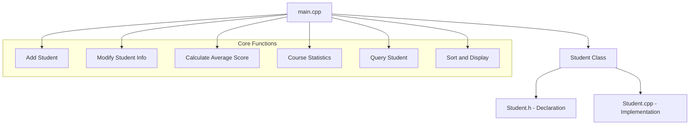
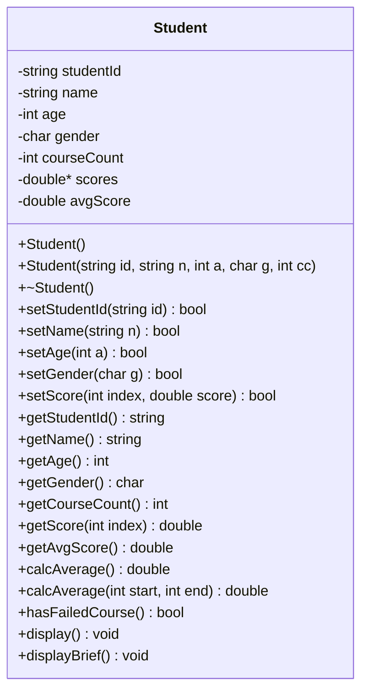

# Student Management System - Project Design

## System Architecture



## Class Diagram



## File Structure

```
cpp-student/
├── Student.h      # Student class declaration
├── Student.cpp    # Student class member function implementation
└── main.cpp       # Main function with menu system
```

## API/Function List

### Student Class (Student.h / Student.cpp)

| Function | Description |
|----------|-------------|
| `Student()` | Default constructor |
| `Student(id, name, age, gender, courseCount)` | Parameterized constructor |
| `~Student()` | Destructor - releases memory and prints author info |
| `setStudentId(id)` | Set student ID with validation (10 digits) |
| `setName(name)` | Set name with validation (max 8 chars) |
| `setAge(age)` | Set age with validation |
| `setGender(gender)` | Set gender (M/F only) |
| `setScore(index, score)` | Set single course score (0-100) |
| `calcAverage()` | Calculate average of all courses (overload 1) |
| `calcAverage(start, end)` | Calculate average of courses in range (overload 2) |
| `hasFailedCourse()` | Check if any course score < 60 |
| `display()` | Display full student information |
| `displayBrief()` | Display brief info (ID, name, gender, average) |

### Main Function Features (main.cpp)

| Function | Description |
|----------|-------------|
| `inputStudents()` | Input n students from keyboard |
| `modifyStudent()` | Modify student information |
| `modifySingleScore()` | Modify single course score |
| `showAllStudents()` | Display all students |
| `queryByIdOrName()` | Query student by ID or name |
| `showCourseStats()` | Show course statistics (avg, max, min) |
| `sortByIdAsc()` | Sort by student ID ascending |
| `sortByIdDesc()` | Sort by student ID descending |
| `sortByAvgAsc()` | Sort by average score ascending |
| `sortByAvgDesc()` | Sort by average score descending |

## Data Validation Rules

1. **Student ID**: Must be exactly 10 digits (0-9)
2. **Name**: Maximum 8 characters (English only in code)
3. **Gender**: Only 'M' (Male) or 'F' (Female)
4. **Score**: Must be between 0 and 100 (inclusive)
5. **Age**: Must be positive integer

## Student Types

- **Type A**: 5 courses
- **Type B**: 3 courses

## UI/UX Design

- Console-based menu system
- Clear prompts for all inputs
- Formatted table output for student lists
- Error messages for invalid inputs
- Confirmation messages for successful operations
